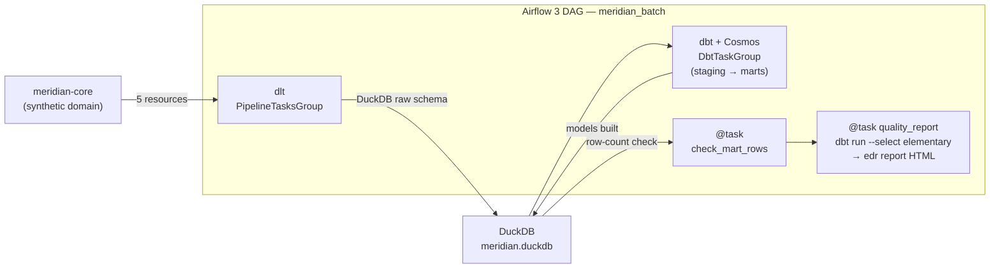

# meridian-airflow

> Same dlt → DuckDB → dbt → Elementary pipeline as `meridian-batch-platform`, orchestrated with **Airflow 3** (Astronomer) instead of Dagster — a side-by-side comparison for recruiters and reviewers.

[](https://github.com/AndreFelippeVidal/meridian-airflow/actions/workflows/ci.yml)


**Companion repo:** [meridian-batch-platform](https://github.com/AndreFelippeVidal/meridian-batch-platform) (Dagster version)

## Why this exists

Airflow is deployed in ~80% of data teams. This repo keeps the same synthetic marketplace domain (customers → orders → payments → dbt marts) but replaces Dagster's asset-centric model with Airflow 3's task graph — so both approaches can be compared against identical data. The interesting diff is in `dags/meridian_dag.py` vs the Dagster `orchestration/` layer.

## Architecture



Every task that opens the DuckDB file (dlt, all Cosmos models, both `@task`s)
shares a **1-slot `duckdb` Airflow pool** so writes are serialized — DuckDB is
single-writer. See [ADR-0003](docs/adr/0003-duckdb-single-writer-pool.md).

Key decisions → [`docs/adr/`](docs/adr/): [Airflow over Dagster](docs/adr/0002-airflow3-over-dagster.md) · [DuckDB single-writer pool](docs/adr/0003-duckdb-single-writer-pool.md) · [Elementary in the quality task](docs/adr/0004-elementary-in-quality-task.md)

## Stack

| Layer | Tool | Why |
|-------|------|-----|
| Domain | [meridian-core v0.2.0](https://github.com/AndreFelippeVidal/meridian-core) | Shared synthetic data generators — same as Dagster version |
| Ingestion | [dlt](https://dlthub.com) `PipelineTasksGroup` | dlt's first-class Airflow helper; one Airflow task per resource |
| Warehouse | DuckDB | Embedded, zero-infra — same file as the Dagster version |
| Transform | dbt-duckdb + [Cosmos](https://astronomer.github.io/astronomer-cosmos/) `DbtTaskGroup` | Cosmos reads `manifest.json` → one Airflow task per dbt model |
| Quality | [Elementary](https://www.elementary-data.com/) `edr report` | Lineage-aware anomaly detection; runs as a plain `@task` |
| Orchestration | [Airflow 3](https://airflow.apache.org/) via [Astro CLI](https://docs.astronomer.io/astro/cli) | Production-grade local Docker environment; `astro dev start` |

## Quickstart

```bash
# Prerequisites: uv (https://docs.astral.sh/uv/), Astro CLI (brew install astro)

make setup          # uv venv + install + pre-commit + airflow db init
make dag-parse      # validate DAG loads with zero import errors

# Run pipeline steps manually (without Docker):
make ingest         # dlt → DuckDB raw schema
make transform      # dbt build — staging + marts
make edr-report     # Elementary quality report

# Airflow UI (standalone, no Docker required):
make airflow-dev    # http://localhost:8080  admin/admin

# Full Astro Docker stack:
make astro-dev      # http://localhost:8080
```

## Dagster vs Airflow comparison

| Concept | Dagster (meridian-batch-platform) | Airflow 3 (this repo) |
|---------|----------------------------------|----------------------|
| dlt wiring | `@dlt_assets` + `DagsterDltResource` | `PipelineTasksGroup` |
| dbt wiring | `@dbt_assets` + `DbtCliResource` | `DbtTaskGroup` (Cosmos) |
| Quality check | `@dg.asset_check(blocking=True)` | `@task` + `AirflowFailException` |
| Lineage | Asset graph across all models | Task graph per DAG run |
| UI | Dagster Webserver (asset-centric) | Airflow Webserver (task-centric) |
| Concurrency guard | Dagster job isolation | `max_active_runs=1` on DAG |
| Test harness | `dagster.materialize([...])` | `DagBag` structural tests |

## Tests

```bash
make test           # 21 tests — domain, ingestion, dbt, data quality, Iceberg, DAG structure
```

| Test file | What it covers |
|-----------|---------------|
| `tests/test_domain.py` | meridian-core generators (referential integrity, determinism) |
| `tests/test_ingestion.py` | dlt row counts, idempotency, no failed jobs |
| `tests/test_dbt.py` | dbt build exit 0, mart tables exist in DuckDB |
| `tests/test_data_quality.py` | Bad-row detection roundtrip (negative GMV caught by dbt test) |
| `tests/test_iceberg.py` | Iceberg row counts, snapshots, DuckDB iceberg_scan |
| `tests/test_dag.py` | DAG loads, task groups present, quality tasks present, config |

## What I learned

**dlt vs Dagster integration**: `PipelineTasksGroup` with `decompose="serialize"` maps each dlt resource to a separate Airflow task automatically — essentially the same behavior as `@dlt_assets` in Dagster, but without needing the Dagster SDK. The key difference is that Dagster adds metadata (row counts, timestamps) to the asset panel automatically; Airflow requires explicit XCom pushes or custom logging for the same effect.

**Cosmos + DuckDB**: Cosmos has no built-in `DuckDBProfileMapping`, so you pass `profiles_yml_filepath` directly to `ProfileConfig`. This is ~5 lines but took some discovery. The upside is that Cosmos reads the same `manifest.json` that `dbt compile` generates, so there's no schema duplication.

**Airflow 3 import paths**: Airflow 3 moved `dag`, `task`, and exceptions to `airflow.sdk`. The old `airflow.decorators` paths still work but log deprecation warnings. The cleaner import is `from airflow.sdk import dag, task`. The Astro image for Airflow 3 also lives on a new registry — `astrocrpublic.azurecr.io/runtime`, not the old `quay.io/astronomer/astro-runtime` (which is still 2.x).

**DuckDB concurrency — the real fix**: my first instinct, `max_active_runs=1`, only stops two *DAG runs* from overlapping — it does nothing about parallelism *within* a run, and Cosmos runs independent dbt models concurrently. They collided on DuckDB's single-writer lock. The fix is a **1-slot Airflow pool** (`duckdb`) assigned to every task that opens the file — a mutex that lives in orchestration config, not application code. ([ADR-0003](docs/adr/0003-duckdb-single-writer-pool.md))

**Cosmos test ordering**: with the default `TestBehavior.AFTER_EACH`, Cosmos runs each model's tests right after that model builds — but `relationships` tests reference *other* models that may not exist yet, so they failed intermittently. `TestBehavior.AFTER_ALL` defers all tests to a single `transform_test` task after every model is built.

**Elementary ships its own dbt project**: `edr report` runs `dbt deps` against an internal dbt project bundled inside the pip package, in root-owned `site-packages`. In the Astro image the `astro` user can't write there → `Permission denied: 'dbt_packages'`. Two prior fixes aimed at the *wrong* `dbt_packages` (our transform project's, which was fine); the container `ls -la` was what finally pinned the real directory. Fix: `chmod a+w` that internal project at image-build time. Lesson: get ground truth from the running container before theorising.

At 10× scale I'd replace DuckDB with Iceberg on object storage + Trino (or Snowflake), keep dlt and Cosmos, and move Airflow to Astronomer Cloud (or MWAA). The orchestrator swap would be nearly zero-effort — and the whole `duckdb` pool disappears, because a real warehouse handles concurrent writes.

## Roadmap

- [x] dlt ingestion (5 resources, DuckDB raw schema)
- [x] dbt transform (staging + 5 mart models)
- [x] Elementary data quality report
- [x] Iceberg taste track (schema evolution + time travel)
- [x] Airflow 3 DAG (PipelineTasksGroup + DbtTaskGroup + quality @task)
- [x] DAG structural tests (DagBag)
- [x] Astro CLI scaffold (Dockerfile + requirements.txt)
- [x] End-to-end run in Astro Docker (dlt → dbt → Elementary report, green)
- [x] GitHub Actions CI (ruff + mypy + pytest)
- [ ] `astro dev start` integration test (Docker-in-Docker)

---
Part of the **Meridian** data + AI platform portfolio.  
See [meridian-batch-platform](https://github.com/AndreFelippeVidal/meridian-batch-platform) for the Dagster version.
